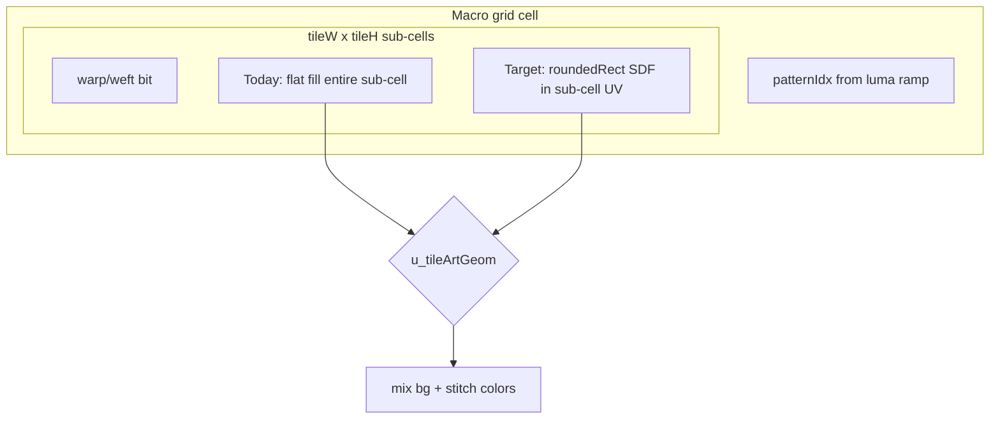

# Tile art rounded rects

## Goal

In **Tile art** (`rectColorSource = 3`), render each warp/weft cell inside a macro tile as a **rounded rect** (oriented by draft), matching the existing Mosaic/Weave stitch look. User chose a **Flat | Rounded** toggle, **default Rounded**.

## Current vs target



| Mode | Behavior |
|------|----------|
| **Flat** (0) | Keep today: `tileVec = warpCol \| weftCol` for whole sub-cell |
| **Rounded** (1) | Sub-cell `fract(cellUV * tileW/H)` → `p = subUV - 0.5` → `roundedRect` with warp/weft `halfSize` → AA mask → color only inside stitch |

Macro-cell **threshold**, **ramp**, **dither**, **stitch-in**, and **color modes** unchanged.

## Shader — [`src/shaders/fragmentImageRects.glsl`](src/shaders/fragmentImageRects.glsl)

Inside the `u_rectColorSource > 2.5` block (~lines 371–408):

1. Add `uniform float u_tileArtGeom;` — `0` flat, `1` rounded (default `1` from JS).

2. After `isWeftTile` lookup, compute sub-cell UV:

   ```glsl
   vec2 subUV = fract(vec2(cellUV.x * tileW, cellUV.y * tileH));
   vec2 pSub = subUV - 0.5;
   ```

3. **Rounded branch** (mirror macro stitch math at lines 333–349):
   - `ratio = clamp(u_rectRatio, 0.02, 1.0)` (no luma size in tile art sub-cells unless we want parity later — skip for v1)
   - `halfY = 0.5 * ratio`, `halfX = halfY * clamp(u_rectAspect, 0.2, 2.0)`
   - `halfSize = isWeftTile > 0.5 ? vec2(halfY, halfX) : vec2(halfX, halfY)`
   - `d = roundedRect(pSub, halfSize, clamp(u_rectRadius, 0.0, 0.5))`
   - **Sub-cell AA:** `subEdge = (gridSize * max(tileW, tileH)) / min(u_resolution.x, u_resolution.y)` so edge width ≈ 1 screen pixel per mini stitch
   - `stitchMask = 1.0 - smoothstep(-subEdge, subEdge, d)`
   - `tileVec = mix(bgVec, warpCol|weftCol, stitchMask)` (gaps show **field** bg — matches tile-wall negative space)
   - Tint mode: same mask, weft/warp colors from quantized image as today

4. **Flat branch:** existing `isWeftTile` color assignment when `u_tileArtGeom < 0.5`.

5. Still apply `occupied * revealMulTile` on final `mix(bgVec, tileVec, occupied)`.

No new textures; reuse `roundedRect`, `u_rectRadius`, `u_rectAspect`, `u_rectRatio`.

## JS plumbing

| File | Change |
|------|--------|
| [`useImageRectsSandbox.js`](src/hooks/useImageRectsSandbox.js) | `tileArtGeom` param + `u_tileArtGeom` uniform |
| [`ImageRectsCanvas.jsx`](src/components/ImageRectsCanvas.jsx) | Pass `tileArtGeom` |
| [`urlDefaults.js`](src/urlDefaults.js) | `tileArtGeom: 1` (rounded default) |
| [`AppV2.jsx`](src/AppV2.jsx) | State, URL `tag` (0\|1), **SegmentedControl** Flat \| Rounded in Pattern ramp + **AppTooltip**; when `rectColorSource === 3`, show **Rect shape** sliders (corner radius, aspect, ratio) — re-enable hidden controls for Tile art only per [`docs/FEATURES.md`](docs/FEATURES.md) § Disabled #2 |
| [`mosaicKeyframe.js`](src/keyframe/mosaicKeyframe.js) | `tileArtGeom` in snapshot/apply |
| [`docs/FEATURES.md`](docs/FEATURES.md) | Tile art: geometry toggle + rect shape sliders when active |

## UI copy (tooltips)

- **Geometry:** “Flat fills each mini cell; Rounded draws warp/weft stitches like Weave.”
- **Corner radius / aspect / ratio:** Reuse existing Mosaic stitch descriptions (only visible in Tile art).

## Verification

- `npm run build`
- Mosaic + Tile art + image: **Rounded** shows separated stitches per draft; **Flat** matches prior look
- Toggle + `tag` URL round-trip
- High `gridSize` (64+) spot-check performance (more SDF evals per pixel)

## Out of scope

- Luma-sized sub-stitches in tile art
- Print mosaic / combo pass-through (unless trivial prop passthrough later)
